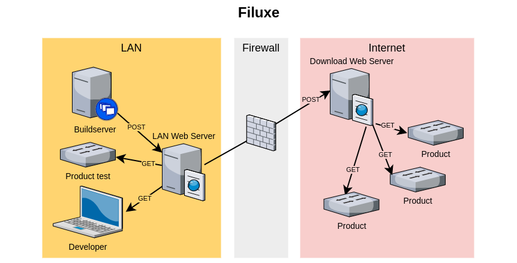

# Filuxe

A super lightweight web mirrored file storage, completely free of any ties to any frameworks with cool names, specific artifacts and manifest files written for package management systems you have no intention of diving into. Filuxe was made with one task in mind: publishing software update packages for embedded systems to update from.

So that kind of boils down to something that can be solved geek style with one or more entities of ftp servers, rsync, mounted fileshares and/or network filesystems. When such a system runs like a clockwork it is super cool, when it fails its a nightmare. And the industry standard 200 pound gorillas of artifact systems where just too overwhelming and slightly off for a simple task like what is needed here.

This project is in the proof of concept phase. If you would like to play along then it should only be for the fun of it.

The following image is Filuxe in a nutshell. Buildservers, test systems and developers use a LAN webserver for storing artifacts which can be consumed locally and a forwarder service maintains an image of released artifacts on an external server for Products to use.

Filuxe has absolutely no built in security of any kind so it is only useful if the artifacts are fully encrypted from buildserver to consumers/products. If a small project like this tried to be secure it would be littered with security flaws anyway. Since you should always be allowed to email a new hotfix firmware to someone anywhere on the globe Filuxe should never be required to have better security than that, meaning none at all.

With encrypted files during transport the products will always be able to detect invalid files and be able to  reject them. There is the secondary security issue which will be to protect the WAN webserver from the bad people. Not that the bad people will be able to get the products to install something hacked, but simply the nuisance it will be if say a firmware update service is disrupted. This is about hardening internet servers which is definitely beyond the scope of this project. 

To verify that filuxe currently works at all then run the livetest script:

`PYTHONUNBUFFERED=1 ./livetest.py`

There are more documentation [here](https://filuxe.readthedocs.io/en/latest/) with among others 'a quick spin' page (which is a diy livetest).

# Some related reading

Article about rclone on [hackaday](https://hackaday.com/2020/11/10/linux-fu-send-in-the-cloud-clones/)

