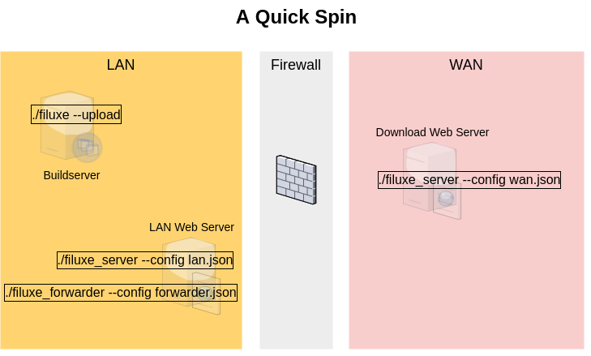

##############################
A quick spin
##############################

The quick spin here consists of starting a webserver and a forwarder application on the 'LAN' and a webserver on a 'WAN' where both servers are in fact just running in parallel on the same local PC.

Finally files are uploaded via HTTP from the fictive buildserver to the LAN webserver with the filuxe script, after which the forwarder will hopefully automatically forward the file from the LAN to the WAN webserver filestorage.

Before starting then make local copies of the three configuration files config_lan, config_wan and config_forwarder.json.template where the .template extension is stripped. Finally make a local copy of the file rules.json.template as well.

Also have a look at :doc:`installing </installing>` to get the dependencies installed.

LAN Webserver
=============

As the very first thing the LAN server needs a filestorage to work on. Since the default in the configuration file is /opt/filestorage_lan then make this directory and make it accessible for the user::

    # mkdir -p /opt/filestorage_lan
    # chown user:group /opt/filestorage_lan

Now start the LAN webserver. Its not actually needed unless you would like to work with the LAN filestorage over HTTP but for the sake of this quick walk through that is precisely what you will like to do further below.::

    ./filuxe_server.py --config config_lan.json

Verify that it lists the filestorage root as /opt/filestorage_lan.

WAN Server
==========

Obviously the WAN web server will run on an internet connected server somewhere but here it is just started alongside everything else on the local PC. The web server application itself is the same for both LAN and WAN server.

Since the WAN server will use HTTPS then make a certificates directory and generate the needed SSL keys with a :doc:`openssh oneliner </keysandcertificates>`.

Next make a WAN filestorage as /opt/filestorage_wan like it was done for the LAN web server filestorage and then start the server::

    ./filuxe_server.py --config config_wan.json

Now verify that this server uses the filestorage root /opt/filestorage_wan.

LAN Forwarder
=============

The forwarder application will, based on a rules setup, forward files from the LAN filestorage to the WAN webserver via http (in real life through the company firewall). It needs to know how to forward in the form of a json configuration file. It is default assumed to be named rules.json so make a very rudimentary rules.json with the following content:

::

    {
        "default": {
            "export": "on"
        },
        "dirs": {
            "test": {
                "include": "zip"
            }
        }
    }

Next the forwarder is started. It has its own configuration file bridging the two worlds of LAN and WAN, defining the local LAN filestorage root and the address of the remote WAN web server (which is started further down)::

    ./filuxe_forwarder.py --config config_forwarder.json --debug

Verify that it has started scanning /opt/filestorage_lan and intends to communicate with a "internet" server at localhost:9000.

Buildserver
===========

With the applications running on the LAN and WAN webservers the backbone of Filuxer is now up and running. What is left is to add and remove files from the LAN webserver filestorage and check if the WAN webserver succeeds as a mirror.
Given that everything runs on the same PC there is direct access to the LAN web server filestorage and a quick check is in order to verify that Filuxe is operational:::

    touch /opt/filestorage_lan/direct.zip

Check that it got mirrored:::

    ls /opt/filestorage_wan/
    direct.zip

It were! Now delete the file /opt/filestorage_lan/direct.zip again and watch that the file dissapears from /opt/filestorage_wan/. So far so good.

The problem is that real life buildserver(s) (or whatever the producers are) might have no direct access to the filestorage on the LAN server filesystem. They should instead use the script filuxe.py which is a utility for managing the LAN filestorage via HTTP inside the LAN.

Make a dummy test file::

    touch test.zap

Now anyone on the LAN can add and remove files with the filuxe script. Notice that the source filename and the destination filename are both given as separate entries. Depending on context this can be either handy or rather daft.::

    ./filuxe.py --config config_lan.json --upload --file test.zap --path test/test.zap

The servers will automatically construct missing subdirectories found in the --path argument if they don't exist.

Also notice that it didn't actually work. The file appeared in the LAN filestorage but it didn't show up on the WAN server. This is due to the rules.json made earlier, it specifically stated that only zip files should be forwarded from the 'test' directory. So rename the zap to zip and run the filuxe line above once more. Rather than checking in /opt/filestorage_wan then use filuxe to view the WAN filestorage (notice the new config file, now one that points to the WAN server is needed):::

    ./filuxe.py --config config_wan.json --list --pretty --path test

Which gives:

::

    {
        "directories": [],
        "files": {
            "test/test.zip": {
                "date": 1589750865.268956,
                "size": 11
            }
        }
    }

The net result of the whole exercise to this point is that the file was ultimately saved on the WAN fileserver. Whats left is now that some products or endusers will download files as they see fit. How they do that is not considered part of the filuxe project.

